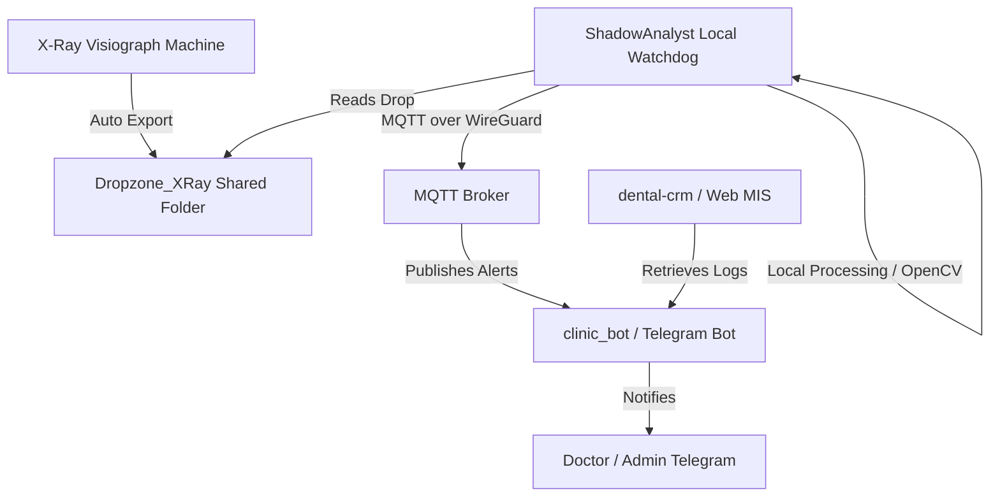

# 🦷 Clinic MVP — Dental CRM & AI-Powered X-Ray Diagnostics Platform

[](https://www.python.org/)
[](https://react.dev/)
[](https://nextjs.org/)
[](https://fastify.dev/)
[](https://mqtt.org/)

**Clinic MVP** is an enterprise-ready, multi-module clinic orchestration platform that combines a **Dental CRM & Medical Information System (MIS)**, an automated **patient-facing Telegram bot with admin panel**, and a local desktop **AI-powered X-Ray diagnostics assistant** (`ShadowAnalyst`).

---

## 📂 Project Architecture & Modules

The platform is designed to run in a hybrid environment (cloud CRM and database coupled with a secure local clinic LAN via WireGuard VPN):



### 💻 1. Dental CRM-MIS (`dental-crm` / `dental-crm111`)
- A React & Fastify web workspace for dentists and receptionists.
- Integrates schedule boards, treatment plan versioning, clinical warning rules, automated billing checks (Stripe/PayPal), and regulatory document generation (KND 1151156, medical card forms).

### 🤖 2. Patient Telegram Bot & Console (`clinic_bot` / `clinic_admin`)
- A Python-based automated Telegram bot client (`telethon`) that updates patients, schedules visits, handles callbacks, and provides safe message templates in Russian.
- Supported by a lightweight management control console (`clinic_admin`) running in Docker.
- Communicates asynchronously with local clinic nodes using an MQTT broker.

### 🔍 3. ShadowAnalyst (`ShadowAnalyst`)
- A desktop background watchdog service that monitors local folder drops (`Dropzone_XRay`).
- When a new X-ray (OPG, bitewing, RVG, CBCT slice) is generated by the clinic's hardware, it automatically processes the image and sends it to a multimodal AI model for expert evaluation.
- Guided by the strict clinical prompting protocol defined in `dentalimage.md` to prevent hallucinations and identify implants, crowns, and anatomical structures.

---

## 🛠️ Local Hardware Integration & Diagnostics

The root folder contains preconfigured Windows batch scripts to easily link local X-ray machines to the automated processing loop:

1. **`1_Расшарить_Рентген_Папку.bat`**: Run once as Administrator to share the `Dropzone_XRay` folder on the local Windows network. Any computer/visiograph in the clinic can auto-save images directly here.
2. **`2_Запуск_XRay_Анализатора.bat`**: Launches the `ShadowAnalyst` background directory scanner. It immediately reads raw image inputs, runs OpenCV frame processing, and fetches AI summaries.
3. **`3_Тест_Демонстрация_Снимка.bat`**: Copies a mock image from `Sample_Images` to trigger a mock diagnostic pipeline and Telegram alert for demonstration.
4. **`Build_ShadowAnalyst_EXE.bat`**: Compiles the Python scanner, local SQLite state, and UI modules into a standalone Windows `.exe` binary.

---

## ⚙️ Requirements & Installation

- **System**: Windows 10/11 (for local watchdog scripts) / Linux VPS (for Docker web deployment)
- **Runtime**: Python 3.10+, Node.js 20+
- **Telemetry**: Mosquitto MQTT Broker (or compatible server)

### 🚀 Getting Started

1. Clone the repository:
   ```bash
   git clone https://github.com/marko1olo/Clinic_MVP.git
   ```

2. Set up environment variables by copying `.env.example` to `.env`.
3. Configure `config.json` or set runtime environment variables:
   ```env
   BOT_TOKEN=your_telegram_bot_token
   MQTT_HOST=your_mqtt_broker_ip
   VPS_PASSWORD=your_secure_ssh_password
   ```

4. Run the local watchdog analyzer:
   ```powershell
   .\2_Запуск_XRay_Анализатора.bat
   ```

---

## 📄 License
This project is licensed under the MIT License.
