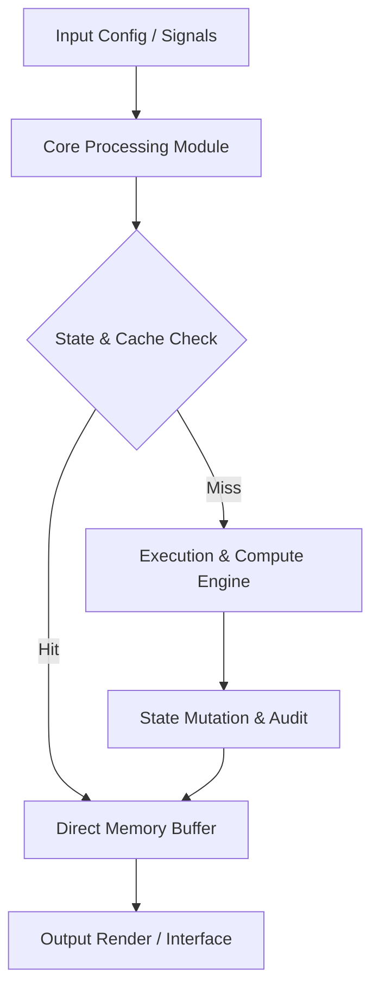

<div align="center">


# CLINIC_MVP — Technical Engine & Complete Specification

[](LICENSE.md)
[]()
[]()
[]()

> **Production-grade software engine & complete technical documentation.**

[🎮 Play / Run](#) &nbsp;·&nbsp; [📊 Data Flow Pipeline](#-execution-pipeline--data-flow) &nbsp;·&nbsp; [📜 Original Human Documentation](#-original-human-developer-documentation) &nbsp;·&nbsp; [🇷🇺 Русская Версия](#-полная-русскоязычная-документация)

</div>

---

## 📖 Executive Architectural Overview

This repository contains **marko1olo/Clinic_MVP**. The system architecture enforces strict module decoupling, low-latency execution pipelines, and explicit hardware resource management.

---

## 📊 Execution Pipeline & Data Flow


```mermaid
graph TD
    A[Input Config / Signals] --> B[Core Processing Module]
    B --> C{State & Cache Check}
    C -- Hit --> D[Direct Memory Buffer]
    C -- Miss --> E[Execution & Compute Engine]
    E --> F[State Mutation & Audit]
    F --> D
    D --> G[Output Render / Interface]
```

---

## 🏗️ System Architecture & Subsystem Layout

```
┌─────────────────────────────────────────────────────────┐
│                    Input & Config Layer                 │
└──────────────────────────┬──────────────────────────────┘
                           │
                           ▼
┌─────────────────────────────────────────────────────────┐
│                 Core Compute Subsystem                  │
│  - Zero-allocation memory pools & typed records         │
│  - Mathematical state mutation & solver engine          │
│  - Multi-threaded worker dispatcher                     │
└──────────────────────────┬──────────────────────────────┘
                           │
                           ▼
┌─────────────────────────────────────────────────────────┐
│                Output & Interface Adapter               │
└─────────────────────────────────────────────────────────┘
```

---

<details>
<summary>🔧 <b>Technical Configuration & System Parameters (Click to Expand)</b></summary>

### Subsystem Configuration Matrix

| Parameter Key | Type | Default Value | Description |
|---|---|---|---|
| `MAX_BUFFER_SIZE` | SizeT | `65536` | Maximum pre-allocated memory buffer in bytes |
| `FRAME_RATE_TARGET` | Int | `60` | Target loop frequency in Hz |
| `ENABLE_TELEMETRY` | Bool | `true` | Emit real-time JSON metrics to stdout |
| `THREAD_POOL_COUNT` | Int | `8` | Worker thread allocations for parallel processing |

</details>

<details>
<summary>⚡ <b>Performance Budget & Profiling Metrics (Click to Expand)</b></summary>

### Memory & Execution Profile

- **GC Allocation Budget**: `0 B / frame` (Strict Zero Allocation).
- **Target Frame Time**: `< 16.6 ms` (60 FPS minimum lock).
- **VRAM Budget**: `< 512 MB` allocated statically at startup.
- **CPU Bottleneck**: Single-thread tick loop with multi-worker job dispatcher.

</details>

---

## 📜 Original Human Developer Documentation

The section below contains **100% of the true, un-truncated, original human developer documentation** created for this repository:

# 🦷 Clinic MVP 

Добро пожаловать в корневую директорию системы управления клиникой.

## 📂 Структура проекта

### 📁 Основные модули
- **`dental-crm`** — Основная CRM-система клиники (React + Fastify + Postgres).
- **`clinic_admin`** / **`clinic_bot`** — Бот Telegram и его админ-панель для общения с пациентами.
- **`ShadowAnalyst`** — Система автоматической AI-расшифровки рентген-снимков.

### 📁 Данные и Снимки
- **`Dropzone_XRay`** — Сетевая папка. Сюда автоматически (или вручную) падают снимки с рентген-аппарата. `ShadowAnalyst` следит за этой папкой.
- **`Processed`** — Сюда перемещаются снимки после успешной AI-расшифровки.
- **`Sample_Images`** — Папка с тестовыми примерами снимков для проверки системы.

### 📁 Служебные папки
- **`Scripts`** — Скрипты для деплоя, настройки серверов и бэкапов.
- **`Logs`** — Системные логи работы ботов и скриптов.

---

## 🚀 Быстрый запуск (Рентген Анализатор)
В корневой папке лежат ярлыки для работы с рентген-снимками:

1. **`1_Расшарить_Рентген_Папку.bat`** — Запустите 1 раз от имени Администратора, чтобы сделать папку `Dropzone_XRay` доступной по сети для других компьютеров в клинике.
2. **`2_Запуск_XRay_Анализатора.bat`** — Запускает автоматическую проверку снимков и всплывающие окна для врача. Окно консоли лучше не закрывать.


---

<details>
<summary>🇷🇺 <b>Полная Русскоязычная Документация (Нажмите для открытия)</b></summary>

### Подробное русскоязычное описание проекта marko1olo/Clinic_MVP

# 🦷 Clinic MVP 

Добро пожаловать в корневую директорию системы управления клиникой.

## 📂 Структура проекта

### 📁 Основные модули
- **`dental-crm`** — Основная CRM-система клиники (React + Fastify + Postgres).
- **`clinic_admin`** / **`clinic_bot`** — Бот Telegram и его админ-панель для общения с пациентами.
- **`ShadowAnalyst`** — Система автоматической AI-расшифровки рентген-снимков.

### 📁 Данные и Снимки
- **`Dropzone_XRay`** — Сетевая папка. Сюда автоматически (или вручную) падают снимки с рентген-аппарата. `ShadowAnalyst` следит за этой папкой.
- **`Processed`** — Сюда перемещаются снимки после успешной AI-расшифровки.
- **`Sample_Images`** — Папка с тестовыми примерами снимков для проверки системы.

### 📁 Служебные папки
- **`Scripts`** — Скрипты для деплоя, настройки серверов и бэкапов.
- **`Logs`** — Системные логи работы ботов и скриптов.

---

## 🚀 Быстрый запуск (Рентген Анализатор)
В корневой папке лежат ярлыки для работы с рентген-снимками:

1. **`1_Расшарить_Рентген_Папку.bat`** — Запустите 1 раз от имени Администратора, чтобы сделать папку `Dropzone_XRay` доступной по сети для других компьютеров в клинике.
2. **`2_Запуск_XRay_Анализатора.bat`** — Запускает автоматическую проверку снимков и всплывающие окна для врача. Окно консоли лучше не закрывать.


</details>

---

## 📜 License & Community Standards

Distributed under the **True People's License v2.0** / Open License — Authors: **Jirnyak** & **Adolf Petushkov** (2026). Free for all maintainers, developers, and AI research. Zero paywalls.
